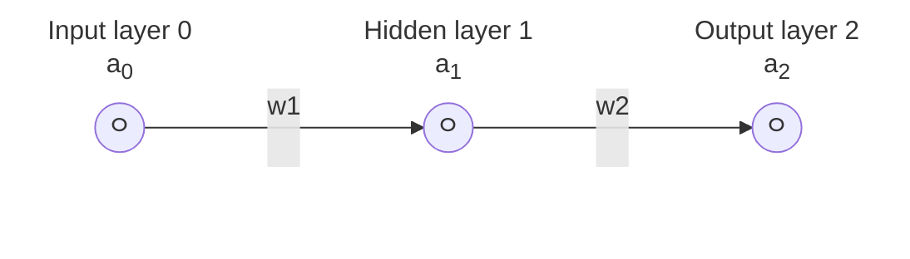

# Dev notes

## Reference

 - How to Create a Neural Network (and Train it to Identify Doodles) by Sebastian Lague, https://www.youtube.com/watch?v=hfMk-kjRv4c
 - Deep neural networks (DNNs) from scratch in Zig by Monad Monkey, https://monadmonkey.com/dnns-from-scratch-in-zig
    - Project repo: https://github.com/SilasMarvin/dnns-from-scratch-in-zig/
    - Discussed on [HackerNews](https://news.ycombinator.com/item?id=35696776) and [Reddit](https://www.reddit.com/r/Zig/comments/12xz0sf/deep_neural_networks_from_scratch_in_zig/)
 - Series by 3Blue1Brown
    - But what is a neural network? | Chapter 1, Deep learning by, https://www.youtube.com/watch?v=aircAruvnKk
    - Gradient descent, how neural networks learn | Chapter 2, Deep learning, https://www.youtube.com/watch?v=IHZwWFHWa-w
    - What is backpropagation really doing? | Chapter 3, Deep learning, https://www.youtube.com/watch?v=Ilg3gGewQ5U
    - Backpropagation calculus | Chapter 4, Deep learning, https://www.youtube.com/watch?v=tIeHLnjs5U8
 - Building a neural network FROM SCRATCH (no Tensorflow/Pytorch, just numpy & math) by Samson Zhang, https://www.youtube.com/watch?v=w8yWXqWQYmU (example against the MNIST dataset)
    - https://www.samsonzhang.com/2020/11/24/understanding-the-math-behind-neural-networks-by-building-one-from-scratch-no-tf-keras-just-numpy
    - https://www.kaggle.com/code/wwsalmon/simple-mnist-nn-from-scratch-numpy-no-tf-keras/notebook

## Math

Note: Math in GitHub

For my own reference, GitHub uses MathJax to render LaTeX math equations in Markdown
files. If you want to modify some of the equations, you can use this playground,
https://www.mathjax.org/#demo. I am using the delimiter syntax variant ([added in May
2023](https://github.blog/changelog/2023-05-08-new-delimiter-syntax-for-inline-mathematical-expressions/))
where you start the expression with <code>$\`</code> and end it with <code>\`$</code> in
order to avoid syntax conflicts with GitHub markdown.

In order to explain and lay out the math equations we're going to be using, let's use this
ridiculously simple neural network that has just 3 nodes connected by 2 weights.

#### Forward propagation:

This just means that we're going to feed the input through each layer in the network to
the next until we get the output in the final layer.

Some variable explanations:

 - $`a0`$: The input to the network. This is often labeled as $`x`$. Labeling the input as an "activation" is a bit strange since it hasn't been through our activation function but it just makes our notation a bit more consistent.
 - $`w_1`$, $`w_2`$: The weight of the connection

Equations:

 - $`z_1 = a_0*w_1 + b_1`$: The weighted input to the 1st layer
 - $`a_1 = ActivationFunction(z_1)`$: activation 1 (the output from layer 1)
 - $`z_2 = a_1*w_2 + b_2`$: The weighted input to the 2nd layer
 - $`a_2 = ActivationFunction(z_2)`$: activation 2 (the output from layer 2)
 - $`c = CostFunction(a_2, \mathrm{expected\_output})`$: Cost (also known as loss) ($`\mathrm{expected\_output}`$ is often labeled as $`y`$)

#### Backward propagation:

With backwards propagation, our goal is to minimize the cost function which is achieved
by adjusting the weights and biases. In order to find which direction we should step in
order to adjust the weights and biases, we need to find the slope of the cost function
with respect to the weights and biases. The pure math way to find the slope of a
function is to take the derivative (same concepts that you learned in calculus class).
If we keep taking these steps downhill, we will eventually reach a local minimum of the cost
function (where the slope is 0) which is the goal. This process is called gradient descent.

If we keep these steps proportional to the slope, then when the slope is flattening out
approaching a local minimum, our steps get smaller and smaller which helps us from
overshooting. This is why our learn rate is some small number.

The partial derivative of cost with respect to the weight of the 2nd connection.
$`\begin{aligned}
\frac{\partial c}{\partial w_2} &= \frac{\partial z_2}{\partial w_2} &\times& \frac{\partial a_2}{\partial z_2} &\times& \frac{\partial c}{\partial a_2}
\\&= a_1 &\times& \verb|activation_function.derivative|(z_2) &\times& \verb|cost_function.derivative|(a_2, \mathrm{expected\_output})
\end{aligned}`$

The partial derivative of cost with respect to the weight of the 1st connection.
$`\begin{aligned}
\frac{\partial c}{\partial w_1} &= \frac{\partial z_1}{\partial w_1} &\times& \frac{\partial a_1}{\partial z_1} &\times& \frac{\partial z_2}{\partial a_1} &\times& \frac{\partial a_2}{\partial z_2} &\times& \frac{\partial c}{\partial a_2}
\\&= a_0 &\times& \verb|activation_function.derivative|(z_1) &\times& w_2 &\times& \verb|activation_function.derivative|(z_2)  &\times& \verb|cost_function.derivative|(a_2, \mathrm{expected\_output})
\end{aligned}`$

The partial derivative of cost with respect to bias of the 2nd node.
$`\begin{aligned}
\frac{\partial c}{\partial b_2} &= \frac{\partial z_2}{\partial b_2} &\times& \frac{\partial a_2}{\partial z_2} &\times& \frac{\partial c}{\partial a_2}
\\&= 1 &\times& \verb|activation_function.derivative|(z_2) &\times& \verb|cost_function.derivative|(a_2, \mathrm{expected\_output})
\end{aligned}`$

When expanding the network with more nodes per layer, TODO

## Zig

Libraries for linear algebra stuff (working with vectors, matrices).

 - [`zmath`](https://github.com/michal-z/zig-gamedev/tree/main/libs/zmath)
    - https://zig.news/michalz/fast-multi-platform-simd-math-library-in-zig-2adn
 - [`zalgebra`](https://github.com/kooparse/zalgebra)
 - [`zlm`](https://github.com/ziglibs/zlm)
