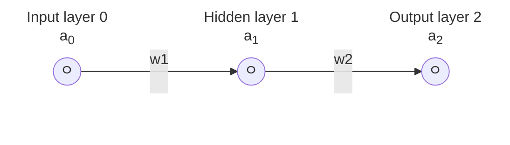

# Dev notes


## Reference

 - How to Create a Neural Network (and Train it to Identify Doodles) by Sebastian Lague, https://www.youtube.com/watch?v=hfMk-kjRv4c
 - Deep neural networks (DNNs) from scratch in Zig by Monad Monkey, https://monadmonkey.com/dnns-from-scratch-in-zig
    - Project repo: https://github.com/SilasMarvin/dnns-from-scratch-in-zig/
    - Discussed on [HackerNews](https://news.ycombinator.com/item?id=35696776) and [Reddit](https://www.reddit.com/r/Zig/comments/12xz0sf/deep_neural_networks_from_scratch_in_zig/)
 - Series by 3Blue1Brown
    - But what is a neural network? | Chapter 1, Deep learning by, https://www.youtube.com/watch?v=aircAruvnKk
    - Gradient descent, how neural networks learn | Chapter 2, Deep learning, https://www.youtube.com/watch?v=IHZwWFHWa-w
    - What is backpropagation really doing? | Chapter 3, Deep learning, https://www.youtube.com/watch?v=Ilg3gGewQ5U
    - Backpropagation calculus | Chapter 4, Deep learning, https://www.youtube.com/watch?v=tIeHLnjs5U8
 - Building a neural network FROM SCRATCH (no Tensorflow/Pytorch, just numpy & math) by Samson Zhang, https://www.youtube.com/watch?v=w8yWXqWQYmU (example against the MNIST dataset)
    - https://www.samsonzhang.com/2020/11/24/understanding-the-math-behind-neural-networks-by-building-one-from-scratch-no-tf-keras-just-numpy
    - https://www.kaggle.com/code/wwsalmon/simple-mnist-nn-from-scratch-numpy-no-tf-keras/notebook


## Math

<details>
<summary>Note: Math in GitHub</summary>

For my own reference, GitHub uses MathJax to render LaTeX math equations in Markdown
files. If you want to modify some of the equations, you can use this playground,
https://www.mathjax.org/#demo. I am using the delimiter syntax variant ([added in May
2023](https://github.blog/changelog/2023-05-08-new-delimiter-syntax-for-inline-mathematical-expressions/))
where you start the expression with <code>$\`</code> and end it with <code>\`$</code> in
order to avoid syntax conflicts with GitHub markdown.

</details>


In order to explain and lay out the math equations we're going to be using, let's use this
ridiculously simple neural network that has just 3 nodes connected by 2 weights.



#### Forward propagation:

Forward propagation just means that we're going to feed the input through each layer in
the network to the next until we get the output in the final layer.

Some variable explanations:

 - $`a0`$: The input to the network. This is often alternatively labeled as $`x`$. Labeling the input as an "activation" is a bit strange since it hasn't been through our activation function but it just makes our notation a bit more consistent.
 - $`w_1`$, $`w_2`$: The weight of the connection
 - $`b_1`$, $`b_2`$: The bias of the node

Equations:

 - $`z_1 = a_0*w_1 + b_1`$: The weighted input to the 1st layer
 - $`a_1 = ActivationFunction(z_1)`$: activation 1 (the output from layer 1)
 - $`z_2 = a_1*w_2 + b_2`$: The weighted input to the 2nd layer
 - $`a_2 = ActivationFunction(z_2)`$: activation 2 (the output from layer 2)
 - $`c = CostFunction(a_2, \mathrm{expected\_output})`$: Cost (also known as loss) ($`\mathrm{expected\_output}`$ is often labeled as $`y`$)


#### Backward propagation:

With backwards propagation, our goal is to minimize the cost function which is achieved
by adjusting the weights and biases. In order to find which direction we should step in
order to adjust the weights and biases, we need to find the slope of the cost function
with respect to the weights and biases. The pure math way to find the slope of a
function is to take the derivative (same concepts that you learned in calculus class).
If we keep taking these steps downhill, we will eventually reach a local minimum of the cost
function (where the slope is 0) which is the goal. This process is called gradient descent.

If we keep these steps proportional to the slope, then when the slope is flattening out
approaching a local minimum, our steps get smaller and smaller which helps us from
overshooting. This is also why our learn rate is some small number so we don't overshoot
and bounce around the local minimum valley.

(equations sourced from [Sebastian Lague's video](https://youtu.be/hfMk-kjRv4c?si=uCiN2nx5k6M0aWO6&t=2230))

The partial derivative of cost with respect to the **weight** of the 2nd connection.
(the parts in blue are the pieces we're calculating in
`calculateOutputLayerShareableNodeDerivatives(...)`)

$`\begin{aligned}
\frac{\partial c}{\partial w_2} &=
\frac{\partial z_2}{\partial w_2} &\times&
\color{#107bc3}{\frac{\partial a_2}{\partial z_2}} &\times&
\color{#107bc3}{\frac{\partial c}{\partial a_2}}
\\&=
a_1 &\times&
\color{#107bc3}{\verb|activation_function.derivative|(z_2)} &\times&
\color{#107bc3}{\verb|cost_function.derivative|(a_2, \mathrm{expected\_output})}
\end{aligned}`$

The partial derivative of cost with respect to the **weight** of the 1st connection.
(the parts in green are the pieces we're calculating in
`calculateHiddenLayerShareableNodeDerivatives(...)`)

$`\begin{aligned}
\frac{\partial c}{\partial w_1} &=
\frac{\partial z_1}{\partial w_1} &\times&
\color{#008b6c}{\frac{\partial a_1}{\partial z_1}} &\times&
\color{#008b6c}{\frac{\partial z_2}{\partial a_1}} &\times&
\color{#008b6c}{\frac{\partial a_2}{\partial z_2}} &\times&
\color{#008b6c}{\frac{\partial c}{\partial a_2}}
\\&=
a_0 &\times&
\color{#008b6c}{\verb|activation_function.derivative|(z_1)} &\times&
\color{#008b6c}{w_2} &\times&
\color{#008b6c}{\verb|activation_function.derivative|(z_2)}  &\times&
\color{#008b6c}{\verb|cost_function.derivative|(a_2, \mathrm{expected\_output})}
\end{aligned}`$

The partial derivative of cost with respect to **bias** of the 2nd node. (this applies
to both hidden and output layers)

$`\begin{aligned}
\frac{\partial c}{\partial b_2} &=
\frac{\partial z_2}{\partial b_2} &\times&
\color{#107bc3}{\frac{\partial a_2}{\partial z_2}} &\times&
\color{#107bc3}{\frac{\partial c}{\partial a_2}}
\\&=
1 &\times&
\color{#107bc3}{\verb|activation_function.derivative|(z_2)} &\times&
\color{#107bc3}{\verb|cost_function.derivative|(a_2, \mathrm{expected\_output})}
\end{aligned}`$

TODO: Chain rule for how these are derived (chain rule tree reference: https://youtu.be/tIeHLnjs5U8?si=WJwPWW_OOkkUGk_S&t=129)


When expanding the network with more nodes per layer, TODO

### Activation functions

#### Softmax

Sources:

 - Help from Hans Musgrave
 - [*Softmax Layer from Scratch | Mathematics & Python
   Code*](https://youtu.be/AbLvJVwySEo?si=uhGygTuChG8xMjGV&t=181) by The Independent
   Code
 - Dahal, Paras. (Jun 2017). [Softmax and Cross Entropy Loss. Paras Dahal.](https://www.parasdahal.com/softmax-crossentropy#derivative-of-softmax)

Given the SoftMax equation:
$`
y_i = \frac{e^{x_i}}{\sum\limits_{j=1}^{n} e^{x_j}}
= \frac{\verb|exp_input|}{\verb|exp_sum|}
`$

We can use the quotient rule ($`(\frac{u}{v})' = \frac{u'v - uv'}{v^2}`$) to
find the derivative of the SoftMax equation with respect to a
specific element of the input vector ($`x_k`$):

For convenience, let $`\delta_{ik}`$ denote a symbol meaning $`1`$ if $`i = k`$ and $`0`$ otherwise.

$`
\begin{aligned}
\delta_{ik} &= {\begin{cases}
    1 & \text{if } i = k\\
    0 & \text{otherwise.}
\end{cases}}
\\
\\
\frac{\partial y_i}{\partial x_k} &=
\frac{
    \delta_{ik}e^{x_i}(\sum\limits_{j=1}^{n} e^{x_j}) - e^{x_i}e^{x_k}
}
{
    (\sum\limits_{j=1}^{n} e^{x_j})^2
}
\\&=
y_i\delta_{ik} - y_iy_k
\end{aligned}`$

Or if we want to split up that delta (δ) condition, we will get:

$`\begin{aligned}
\text{If } k = i \text{:}
\\
\frac{\partial y_i}{\partial x_k} &=
\frac{
    e^{x_i}(\sum\limits_{j=1}^{n} e^{x_j}) - e^{x_i}e^{x_i}
}
{
    (\sum\limits_{j=1}^{n} e^{x_j})^2
}
= \frac{\verb|exp_input| * \verb|exp_sum| - \verb|exp_input| * \verb|exp_input|}{\verb|exp_sum| * \verb|exp_sum|}
\\&=
\frac{e^{x_i}}{\sum\limits_{j=1}^{n} e^{x_j}} -
(\frac{e^{x_i}}{\sum\limits_{j=1}^{n} e^{x_j}})^2
\\&=
y_i - (y_i)^2
\\&=
y_i(1 - y_i)
\end{aligned}`$

$`\begin{aligned}
\text{If } k \ne i \text{:}
\\
\frac{\partial y_i}{\partial x_k} &=
e^{x_i}\frac{-e^{x_k}}{(\sum\limits_{j=1}^{n} e^{x_j})^2}
\\&=
-\frac{e^{x_i}}{\sum\limits_{j=1}^{n} e^{x_j}}\frac{e^{x_k}}{\sum\limits_{j=1}^{n} e^{x_j}}
\\&=
-y_iy_k
\end{aligned}`$


## Other nerual network implementations

 - https://github.com/SebLague/Neural-Network-Experiments
    - This codebase has a great video going over all of the details/implementation of the
      code: https://www.youtube.com/watch?v=hfMk-kjRv4c
 - https://github.com/hmusgrave/zsmallnet
 - https://github.com/albert-yu/mnist
 - https://github.com/yettinmoor/mnist
 - https://github.com/SilasMarvin/dnns-from-scratch-in-zig/
    - Associated article: https://monadmonkey.com/dnns-from-scratch-in-zig
 - https://github.com/garrisonhh/perceptron
 - https://github.com/Deins/zig-nnet
    - Has lots of nice comments
 - https://github.com/star-tek-mb/mnist-predictor
 - Python and NumPy: https://github.com/TheIndependentCode/Neural-Network
    - This codebase has a whole YouTube series behind it, ex. [*Softmax Layer from Scratch | Mathematics & Python Code*](https://www.youtube.com/watch?v=AbLvJVwySEo)


## Zig

Libraries for linear algebra stuff (working with vectors, matrices).

 - [`zmath`](https://github.com/michal-z/zig-gamedev/tree/main/libs/zmath)
    - https://zig.news/michalz/fast-multi-platform-simd-math-library-in-zig-2adn
 - [`zalgebra`](https://github.com/kooparse/zalgebra)
 - [`zlm`](https://github.com/ziglibs/zlm)


## Desmos

Export data from tables in Desmos (run the snippet in the JavaScript developer tools console)

Example: https://www.desmos.com/calculator/tkfacez5wt

```js
state = Calc.getState()

for (let i = 0; i < state.expressions.list.length; i++) {
    if (state.expressions.list[i].type == "table") {
        for (let columnIndex = 0; columnIndex < state.expressions.list[i].columns.length; columnIndex += 2) {
            console.log('next set---------------------');
            for (let valueIndex = 0; valueIndex < state.expressions.list[i].columns[columnIndex].values.length; valueIndex += 1) {
                const x = state.expressions.list[i].columns[columnIndex].values[valueIndex];
                const y = state.expressions.list[i].columns[columnIndex + 1].values[valueIndex];
                console.log(`${x}, ${y}`);
            }
        }
    }
}
```
