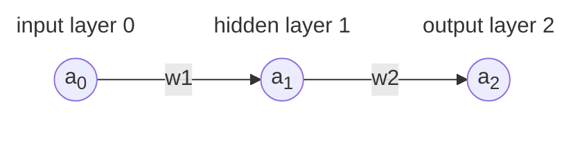

# Dev notes

## Math

<details>
<summary>Note: Math in GitHub</summary>

For my own reference, GitHub uses MathJax to render LaTeX math equations in Markdown
files. If you want to modify some of the equations, you can use this playground,
https://www.mathjax.org/#demo

</details>


In order to lay out the math equations we're going to be using, let's use this
ridiculously simple neural network that has just 3 nodes connected by 2 weights.



#### Forward propagation:

```
z  = a  ⋅ w  + b
 1    0    1    1

a  = ActivationFunction ⎛z ⎞
 1                      ⎝ 1⎠

z  = a  ⋅ w  + b
 2    1    2    2

a  = ActivationFunction ⎛z ⎞
 2                      ⎝ 2⎠

c = CostFunction ⎛a , expectedOutput⎞
                 ⎝ 2                ⎠
```

<details>
<summary><a href="https://arthursonzogni.com/Diagon/#Math">Diagon syntax</a></summary>

```
z_1 = a_0*w_1 + b_1

a_1 = ActivationFunction(z_1)

z_2 = a_1*w_2 + b_2

a_2 = ActivationFunction(z_2)

c = CostFunction(a_2, expectedOutput)
```

</details>


#### Backward propagation:

The partial derivative of cost with respect to the weight of the 2nd connection.
$`\begin{aligned}
\frac{\partial c}{\partial w_2} &= \frac{\partial z_2}{\partial w_2} &\times& \frac{\partial a_2}{\partial z_2} &\times& \frac{\partial c}{\partial a_2}
\\&= a_1 &\times& \verb|activation_function.derivative|(z_2) &\times& \verb|cost_function.derivative|(a_2)
\end{aligned}`$

The partial derivative of cost with respect to the weight of the 1st connection.
$`\begin{aligned}
\frac{\partial c}{\partial w_1} &= \frac{\partial z_1}{\partial w_1} &\times& \frac{\partial a_1}{\partial z_1} &\times& \frac{\partial z_2}{\partial a_1} &\times& \frac{\partial a_2}{\partial z_2} &\times& \frac{\partial c}{\partial a_2}
\\&= a_0 &\times& \verb|activation_function.derivative|(z_1) &\times& w_2 &\times& \verb|activation_function.derivative|(z_2)  &\times& \verb|cost_function.derivative|(a_2)
\end{aligned}`$

The partial derivative of cost with respect to bias of the 2nd node.
$`\begin{aligned}
\frac{\partial c}{\partial b_2} &= \frac{\partial z_2}{\partial b_2} &\times& \frac{\partial a_2}{\partial z_2} &\times& \frac{\partial c}{\partial a_2}
\\&= 1 &\times& \verb|activation_function.derivative|(z_2) &\times& \verb|cost_function.derivative|(a_2)
\end{aligned}`$


## Zig

Libraries for linear algebra stuff (working with vectors, matrices).

 - [`zmath`](https://github.com/michal-z/zig-gamedev/tree/main/libs/zmath)
    - https://zig.news/michalz/fast-multi-platform-simd-math-library-in-zig-2adn
 - [`zalgebra`](https://github.com/kooparse/zalgebra)
 - [`zlm`](https://github.com/ziglibs/zlm)
